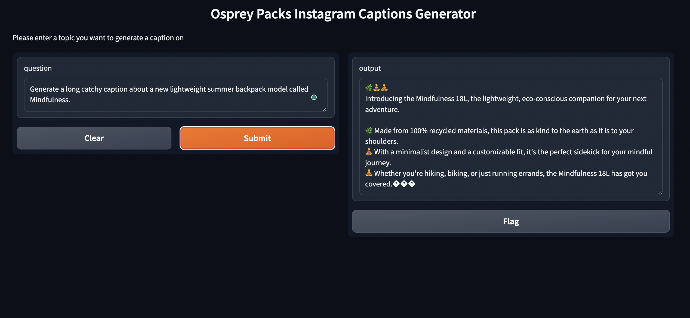

# AI agent for Instagram post-generation
### [Link to the chosen HF model](https://huggingface.co/mistralai/Mistral-7B-Instruct-v0.2)

### To launch UI and test locally: 
1. Log in to your [Hugging Face](https://huggingface.co/) profile
2. Go to *Settings/Access Tokens/New token*
3. Generate a new token with some name of type **Read** and !save! it somewhere
4. Open this notebook in Google Colab
5. Go to *Secrets/Add* new secret
6. In the *Name* section, write **HF_TOKEN**, and in the *Value* – paste previously generated token
7. Grant access to this notebook by swiping the corresponding *Notebook access* slider
8. Go to *Runtime/Change* runtime type, and choose the **T4 GPU** option there
9. Go to *Files/Upload* to session storage, and upload the scraped Instagram data there
10. Run the notebook and keep calm: it may take some time:)

### Demo example:

### Tools and techniques:
Mistral-7B-v0.2 text-generation model, Apify, torch, gradio 
